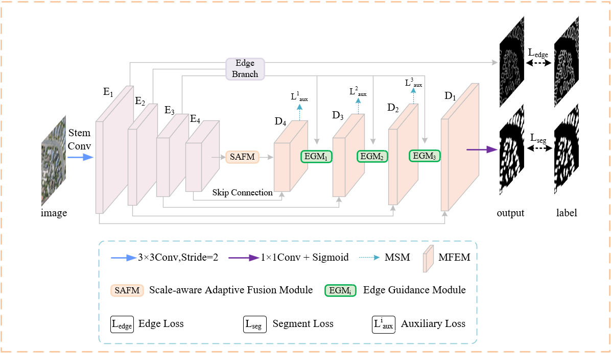

# EGAFNet
## Papers
* EGAFNet: An Edge Guidance and Scale-Aware Adaptive Fusion Network for Building Extraction From Remote Sensing Images (TGRS 2025) [paper](https://ieeexplore.ieee.org/document/10819433) and [source_code](https://github.com/Mw-yang/EGAFNet/)





## Datesets
* [WHU Building Dataset](http://gpcv.whu.edu.cn/data/building_dataset.html)
* [A dataset of building instances of typical cities in China](https://doi.org/10.11922/sciencedb.00620)


## Cite
If you use EGAFNet in your work please cite our paper:

* BibTex：

```
@ARTICLE{10819433,
  author={Yang, Mingwang and Zhao, Like and Ye, Linfeng and Jia, Weishi and Jiang, Huawei and Yang, Zhen},
  journal={IEEE Transactions on Geoscience and Remote Sensing}, 
  title={EGAFNet: An Edge Guidance and Scale-Aware Adaptive Fusion Network for Building Extraction From Remote Sensing Images}, 
  year={2025},
  volume={63},
  number={},
  pages={1-13},
  doi={10.1109/TGRS.2024.3524547}
}
```

* Plane Text：
```
M. Yang, L. Zhao, L. Ye, W. Jia, H. Jiang and Z. Yang, "EGAFNet: An Edge Guidance and Scale-Aware Adaptive Fusion Network for Building Extraction From Remote Sensing Images," in IEEE Transactions on Geoscience and Remote Sensing, vol. 63, pp. 1-13, 2025, Art no. 4700513, doi: 10.1109/TGRS.2024.3524547.
```

## Contact us
```
If you have any problme when running the code, please do not hesitate to contact us. Thanks.  
E-mail: ymw_2000@163.com  
Date: February 20, 2025
```
